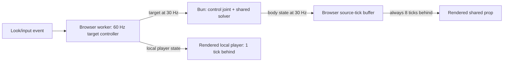
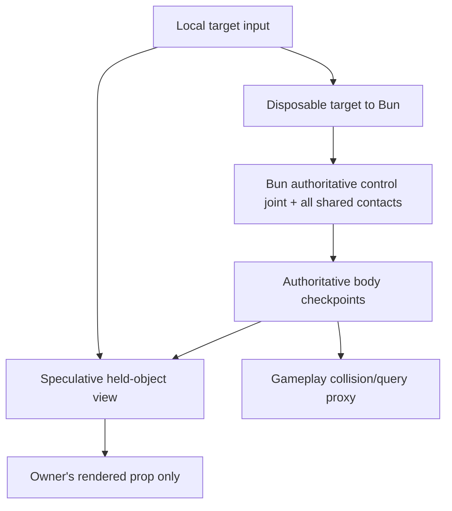

# Networked physics client feel: research and decision guide

This guide answers a narrower question than the
[networked-physics deep dive](networked-physics-deep-dive.md): can Gurgur keep
protocol v6's centralized shared-body authority and recover the client feel that
was lost when loose props stopped being browser-owned?

Research baseline and selected follow-up: 2026-08-01. The code comparisons use
[s&box public `2053455`](https://github.com/Facepunch/sbox-public/tree/2053455813f24165d614cdeaf561082eecc86990)
and
[Source SDK 2013 `88fa198`](https://github.com/ValveSoftware/source-sdk-2013/tree/88fa198fba3fb85d46d4c95018254693fdc3af0a).
The measurements below are exploratory characterizations, not release claims.
The first architecture described here is now selected by
[decision 0023](decisions/0023-client-feel-presentation.md): per-track adaptive
render delay, 60 Hz manipulation targets and hot body state, and an isolated
target-following loose-prop view. The stronger shadow-physics prototype remains
conditional on retained contact fixtures and play testing.

## Answer

Keep the current network authority model for now. It fixed a real correctness
problem: every shared rigid-body contact now has one authoritative solver. The
poor localhost experience is not evidence that this decision was wrong; it is
evidence that only the authoritative half of the design was completed.

Two client-side changes were needed and are now selected:

1. Stop using the eight-tick Adverse-network safety margin as one universal
   presentation policy. Delay must be selected per connection and per consumer,
   from observed late-arrival behavior. Localhost must not render every shared
   body 133.3 ms in the past.
2. Give the player holding a prop an immediate, speculative local view of that
   prop after Bun confirms the claim. It must remain presentation-only: Bun's
   body is gameplay truth, Bun alone resolves shared contacts, and the client
   view reconciles to Bun rather than publishing body state.

The second item is the important missing Source lesson. Source keeps ordinary
shared props server-authoritative, but the multiplayer physcannon creates a
local VPhysics body for the confirmed attachment and runs the shared grab
controller on it. Source does not ask interpolation alone to make a held object
feel responsive.

Do not replace Box3D to solve this latency. The delay is visible before solver
quality enters the question, and using the same Box3D Wasm adapter in Bun and
the browser is useful for a speculative local held-body view. Replace the solver
only if a named conformance, stability, or performance gate fails and another
engine passes the same fixture artifact.

The current authority model becomes insufficient only if the product requires
reciprocal, immediate local consequences from shared physics: a prop shoving the
local player, dynamic vehicles, riding unstable rigid bodies, or contact-driven
movement whose result must be felt before a host round trip. Those features
require the larger Source-style move to server-authoritative players plus local
input prediction, checkpoints, reconciliation, and replay. They cannot be added
by a prettier interpolation curve.

Decision 0023 selects the target-following version and amends the canonical
no-prediction language without changing gameplay authority. Calling it “only
visual” is a boundary enforced by isolated tests,
not a reason to hide the architectural decision.

## What localhost did before decision 0023

The owner and the body are presented on different timelines:

This has three separate delays even with zero simulated network latency:

- input and target production wait for fixed ticks and the 30 Hz disposable
  target cadence;
- Bun must receive the target, step the control joint, and publish body state;
- the renderer deliberately queries the body 8 ticks, or 133.3 ms, behind the
  estimated host time.

The same eight-tick constant also controls browser collision proxies and Bun's
browser-player proxies. Those consumers have different risks. A render buffer
can be adjusted or visually reconciled; a physics proxy affects collision
queries; the host's player proxy affects the authoritative shared solver. One
global number makes the most conservative consumer dictate every visible body.

### Exploratory measurements

The 16-client/128-prop real Bun/WebRTC harness was run for five seconds at each
temporary buffer setting and production was restored to eight ticks afterward.
One run per setting is not statistically sufficient, and scheduler variation
made some profile results non-monotonic. That itself exposes a test-harness gap:
delay policies must be compared by replaying the same recorded arrival trace,
not by generating a different live trace for every policy.

|  Buffer | Added nominal delay | Local underrun | Typical underrun | Adverse underrun |
| ------: | ------------------: | -------------: | ---------------: | ---------------: |
| 2 ticks |             33.3 ms |          4.61% |            0.71% |            0.38% |
| 4 ticks |             66.7 ms |          0.30% |            1.02% |           0.071% |
| 6 ticks |            100.0 ms |             0% |               0% |            0.54% |
| 8 ticks |            133.3 ms |             0% |               0% |               0% |

These runs do not select a new constant. They show that two ticks cannot safely
cover even today's localhost scheduling at a 30 Hz source rate, while the eight
tick setting buys tail safety with client-visible latency whether it is needed
or not.

A temporary real-Chrome pickup trace measured the stages from the page's actual
look callback, excluding Playwright's synthetic event-dispatch overhead:

| Policy  | Confirmed claim | Look to meaningful Bun body response | Look to owner-visible response |
| ------- | --------------: | -----------------------------------: | -----------------------------: |
| 8 ticks |         8–25 ms |                         about 112 ms |                   about 228 ms |
| 4 ticks |         8–25 ms |                          about 79 ms |                   about 112 ms |

The buffer-specific gap in these samples was about 117 ms at eight ticks and
33 ms at four ticks. Cutting the buffer matters, but 112 ms localhost response
still does not feel like a locally controlled object. A target-responsive local
view is required if manipulating props is a core interaction.

The restored production Adverse pickup gate then failed once with a 67.5 cm
single-frame release step against its current 50 cm limit; the immediate rerun
and five further runs passed. One failure in seven runs with the same seeded
impairment but different real scheduling is not a failure-rate estimate. It is
evidence that a pass/fail test which discards the raw arrival and presentation
trace cannot explain or deterministically replay its own tail failure.

## Why s&box felt different

s&box has two relevant behaviors, and copying only one gives a misleading
comparison.

First, generic proxy transforms are interpolated. At the inspected revision,
[`Networking.InterpolationTime`](https://github.com/Facepunch/sbox-public/blob/2053455813f24165d614cdeaf561082eecc86990/engine/Sandbox.Engine/Systems/Networking/Networking.cs#L139)
is a fixed 100 ms. Proxy transforms query their buffer at
`now - InterpolationTime`, while interpolated sync properties are stamped with
local receipt time. This is a general smooth-remote-view mechanism, not a
latency-free physics solution.

Second, ownership makes a much larger difference. The
[s&box ownership contract](https://sbox.game/dev/doc/networking/ownership) says
that an owned object is simulated by its owning connection. Current map physics
props are even configured with takeover ownership so a client can control them.
The old Gurgur held-prop lease therefore resembled the part of s&box that made
local interaction immediate. Protocol v6 deliberately stopped resembling it so
that two peers could not dynamically solve opposite halves of one shared
contact.

s&box remains useful evidence for ownership lifecycle, proxy movement, reliable
pre-handoff state, sleep-aware state, and generic interpolation. It is not proof
that freely transferable prop authority conserves a shared collision across
two solvers. Returning to takeover ownership would recover feel by reopening
the correctness problem that decision 0022 closed.

## The Source design is the closer target

Source separates ordinary remote presentation from locally important predicted
interactions.

### Remote entities

Source transmits entity simulation time, latches samples on the simulation
timeline, and computes interpolation as
`max(cl_interp, cl_interp_ratio / cl_updaterate)`. In the public SDK,
`cl_interp` defaults to 100 ms and the interpolation ratio defaults to two.
Those values demonstrate the same trade: a remote snapshot view is smooth
because it is intentionally in the past.

### Local player and weapon

Source user commands are numbered and replayed. The prediction system restores
an acknowledged frame, re-runs outstanding commands, corrects gameplay state,
and resets interpolation latches when a prediction error would otherwise mix
incompatible samples. That machinery removes round-trip latency from local
movement; ordinary interpolation never could.

### Confirmed held-object prediction

The multiplayer physcannon is a more direct precedent for Gurgur:

- Bun/server decides whether the attachment exists and replicates the attached
  entity handle plus captured position/orientation data;
- on the client,
  [`ManagePredictedObject`](https://github.com/ValveSoftware/source-sdk-2013/blob/88fa198fba3fb85d46d4c95018254693fdc3af0a/src/game/shared/hl2mp/weapon_physcannon.cpp#L2060)
  creates a local VPhysics body for that confirmed entity and attaches the same
  grab controller;
- [`ItemPreFrame`](https://github.com/ValveSoftware/source-sdk-2013/blob/88fa198fba3fb85d46d4c95018254693fdc3af0a/src/game/shared/hl2mp/weapon_physcannon.cpp#L2149)
  updates the predicted object locally whenever the weapon is active;
- the server still owns authoritative attachment, world state, denial, and
  shared contact results.

This is not generic extrapolation of every remote rigid body. It is a narrow
speculative model for the one object under direct local control, driven by the
same input and reconciled to authoritative state. Gurgur should copy that
selectivity, not Source's implementation details blindly.

## What Gaffer adds to the decision

[Snapshot Interpolation](https://gafferongames.com/post/snapshot_interpolation/)
explains why the current body view is delayed: interpolation trades latency for
smoothness, arbitrary rigid-body extrapolation fails around collisions, and the
reliable way to reduce the necessary interpolation delay is to increase the
state send rate. Hermite position interpolation and quaternion slerp can improve
motion quality at a given rate; neither removes the buffer's causal delay.

[State Synchronization](https://gafferongames.com/post/state_synchronization/)
describes the larger alternative. Both peers run physics, updates pass through a
smaller frame-based jitter buffer, authoritative state is applied directly to
simulation, and the resulting error is smoothed only for rendering. That can
support a broader predicted physics view, but it accepts divergence and
correction as normal and requires substantially more bandwidth and proof.

For Gurgur, the practical ladder is:

- snapshot interpolation for bodies the local user is only observing;
- narrow speculative presentation for the one confirmed held object;
- full state synchronization or player prediction only if the product's
  interaction contract actually requires it.

## Recommended client architecture

### 1. Split delay policy by consumer

Use the source-tick timeline already added in protocol v6, but give each
consumer an explicit policy:

| Consumer                      | Recommended behavior                                                                          |
| ----------------------------- | --------------------------------------------------------------------------------------------- |
| Ordinary remote render        | Adaptive interpolation delay derived from late-arrival and buffer occupancy                   |
| Owner's held-body render      | Speculative local view reconciled to a low-delay authoritative track                          |
| Browser collision/query proxy | Conservative fixed-tick target track; never read visual smoothing                             |
| Bun browser-player proxy      | Host policy based on accepted player-state arrival; never tied to a browser render preference |
| Local player render           | At most one completed worker tick plus the next frame                                         |

The adaptive controller should have a product-approved minimum and maximum,
increase quickly when late samples appear, decrease slowly with hysteresis, and
slew the rendered timeline instead of jumping it. RTT is not its control input:
constant latency shifts when a sample arrives, while jitter, loss, reorder, and
source cadence determine how much future sample coverage interpolation needs.

At the former 30 Hz cadence, even a perfect network supplied a new state only
every 33.3 ms. Decision 0023 raises the disposable target and manipulated-body
hot state to 60 Hz while a claim is active, without doubling the ordinary 30 Hz
stream. A broader nearby contact-critical hot set remains a possible measured
extension rather than selected behavior. Send an immediate target on a material
input change and retain a bounded heartbeat.
Gaffer's analysis identifies send rate as the direct lever for reducing
rigid-body snapshot delay. A hot-set policy avoids doubling all 128-prop traffic.

### 2. Add a speculative held-object view

After a reliable claim grant, create a local presentation state for the held
body. Drive it from the browser's 60 Hz target before waiting for the target to
travel to Bun and body state to return. Keep these boundaries explicit:

- the speculative transform is never encoded as owned body state;
- it cannot activate triggers, apply damage, save state, grant a use action, or
  decide release velocity;
- the ordinary Bun-authored proxy remains the input to gameplay queries and the
  browser player controller;
- denial, timeout, release, reset, and disconnect come from Bun;
- authoritative pose error is measured every update and reconciled visually.

The first implementation can be a target-following presentation controller.
The stronger, Source-like version runs one shadow body against static world
geometry and cloned kinematic obstacles. It should live in an isolated
presentation physics world, or have filtering that makes it impossible for the
shadow to affect gameplay queries. Reusing the ordinary browser proxy as a
dynamic predicted body would quietly reintroduce local gameplay authority.

Reconciliation needs named behavior:

- small error: decay a visual offset over a short half-life;
- moderate contact error: converge faster and expose a tether/strain cue;
- impossible or discontinuous state: snap under a declared thresholded event;
- release: keep the shadow briefly, then merge to the Bun body without changing
  Bun's pose or velocity.

Immediate audio, beam, hand pose, reticle, and target marker should begin on the
input edge. They help the claim round trip feel responsive, but they are not a
substitute for responsive prop motion when the prop is the interaction.

### 3. Preserve the authority boundary

The proposal changes presentation, not gameplay truth:

This preserves the main protocol-v6 win: only Bun mutates the shared body's
gameplay state. The local view may be wrong for a few frames near a collision,
but that error is visible and correctable instead of becoming a second
authoritative impulse.

## When the current approach is no longer enough

Adopt server-authoritative players with client prediction and reconciliation if
any required feature answers yes to one of these questions:

- Must a Bun-owned body immediately change the local player's movement?
- Can the player stand on, drive, or be carried by an unpredictable shared
  dynamic body?
- Does competitive gameplay depend on the exact local result of a shared
  physical contact before a round trip?
- Must multiple locally controlled bodies form one reciprocal dynamic island?

In that model, browsers send tick-numbered inputs, predict their player, retain
input/state history, restore acknowledged checkpoints, replay outstanding
commands, and smooth correction error. The host owns the complete player/body
contact island. Predicting arbitrary nearby rigid bodies can be layered on, but
it is a separate state-synchronization problem and should not be assumed to be
deterministic merely because both peers use Box3D.

Do not use s&box-style takeover ownership as the escape hatch unless the product
explicitly accepts trusted clients, non-reciprocal cross-authority contacts, and
handoff artifacts. It is the cheapest way to restore local prop feel and the
most direct way to restore the bug class protocol v6 removed.

## Box3D decision

Nothing measured here implicates Box3D in the latency. Claim, publish cadence,
host round trip, and presentation delay exist outside the solver. Box3D also
already supplies the control joint, collision queries, fixed-step replay, and a
common Bun/browser artifact needed to prototype the shadow view.

The current deterministic replay test compares two runs in one runtime. Before
making a stronger prediction claim, add Bun-versus-real-browser trace comparison
for the exact shadow fixtures. Cross-runtime equality is useful if it holds, but
the proposed presentation view does not require it: divergence is expected,
bounded, measured, and reconciled.

Reconsider Jolt or Rapier only if Box3D fails a retained fixture for CCD,
constraint stability, sleep/contact behavior, resource lifetime, browser cost,
or bounded shadow reconciliation. Run the same compiled map, tick-numbered
target log, and per-tick trace through every candidate. A solver feature list or
standalone throughput benchmark cannot answer the client-feel question.

## Tests that can prove the parts

No isolated test can prove that the game feels good. Tests can prove the
mechanisms and budgets that make good feel possible; a controlled play test
must validate the product threshold.

### Stage-latency trace

Give one manipulation action a trace identity derived from claim version,
target sequence, and source tick. Record timestamps/ticks for:

1. browser input edge and look callback;
2. worker input receipt and target production;
3. target send and Bun receipt;
4. Bun tick that updates the joint;
5. first authoritative body tick that responds;
6. body packet receipt;
7. speculative and authoritative presentation frames.

Use source ticks across peers and `performance.now()` only for stages in the
same browser. Export the raw trace, not just one aggregate duration. A gate
should report which stage consumed the budget.

### Recorded-arrival buffer sweep

Record one authority trace and one packet-arrival trace. Replay that identical
artifact through every candidate delay policy and display rate. Assert
monotonic underrun improvement as delay increases, then report:

- selected delay over time;
- buffer occupancy and late-sample rate;
- underrun frames and longest freeze;
- source-to-presentation age;
- timeline, position, rotation, and speed error;
- delay-change slew and visible discontinuity.

This isolates policy quality from host scheduling. It fixes the confound in the
exploratory sweep above.

### Speculative-view oracle

Feed the presenter a tick-numbered target log, authoritative checkpoints, and
claim lifecycle without networking. Cover unobstructed motion, a static wall, a
moving obstacle, a sleeping stack, denial, timeout, release, and reset. Assert:

- input changes the speculative transform by the next 60 Hz presentation tick;
- speculative state never enters an outbound body-state packet or gameplay
  query world;
- separation from authority stays within a fixture-specific bound;
- convergence time and maximum visible correction stay within budget;
- release and discontinuities do not produce a double body or stale shadow.

Use the unnetworked Bun one-solver trace as gameplay truth. The speculative body
is graded on response and correction, not on rewriting that oracle.

### Real-browser gates

Retain production Chrome coverage and add Firefox/WebKit where the runtime is
supported. Test 60, 120, and 144 Hz with local, Typical, Adverse, and burst-loss
profiles. Starting budgets to validate with play testing are:

| Metric                                          |                   Local target |
| ----------------------------------------------- | -----------------------------: |
| Input to beam/hand/reticle feedback             |            next rendered frame |
| Confirmed claim to speculative prop response    |                p95 under 35 ms |
| Look input to speculative held-prop response    |                p95 under 35 ms |
| Local-player input to presentation              |                p95 under 35 ms |
| Ordinary localhost remote-body presentation age |                p95 under 75 ms |
| Undeclared held-prop correction                 | no single-frame step over 5 cm |
| Release visual discontinuity                    | no single-frame step over 5 cm |

Typical and Adverse tests should keep the local speculative response budget;
network quality changes authoritative separation and convergence, not the time
to acknowledge local input visually. Set those error bounds from retained
collision fixtures and a blinded play test instead of inventing them from the
current implementation.

Functional pickup tests are not feel tests. “The body eventually moved” can pass
with 300 ms latency. Every feel gate must name an input edge, a visible response,
a percentile, a duration, and the browser/display/network profile.

## Decision rule

Decision 0023 selected the first of these prototypes using the same stage trace
and real-browser fixtures:

- adaptive/role-specific buffering plus a target-following speculative held
  view;
- the stronger isolated Box3D shadow-body view if contact plausibility is not
  good enough.

Keep protocol v6 while the selected prototype meets the response, correction,
and discontinuity budgets without allowing speculative state into gameplay.
Escalate to the stronger shadow-body prototype if retained contact scenes fail
visual plausibility. Move to server-authoritative player prediction only if the
desired interaction contract fails because the local player needs reciprocal
shared-body physics—not merely because an intentionally delayed prop was
rendered without its missing local presentation layer.
